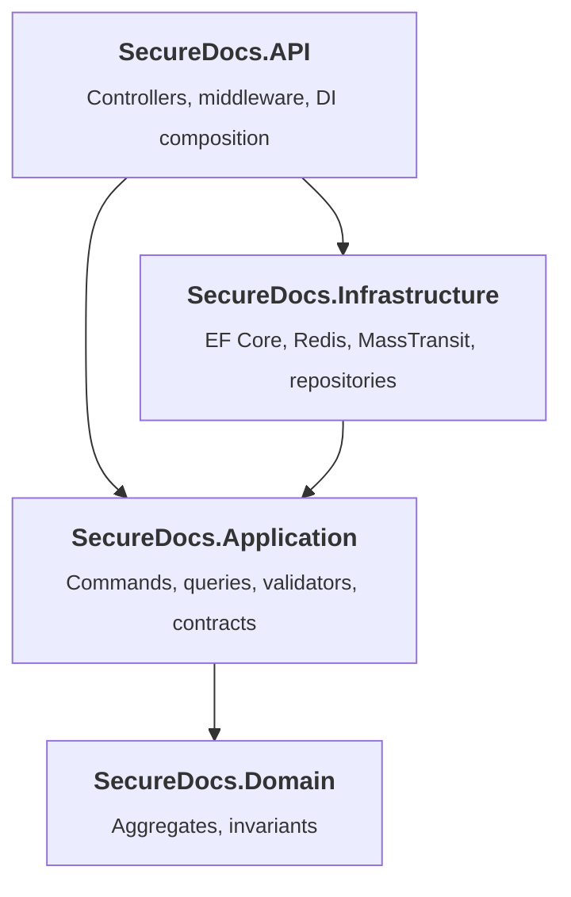
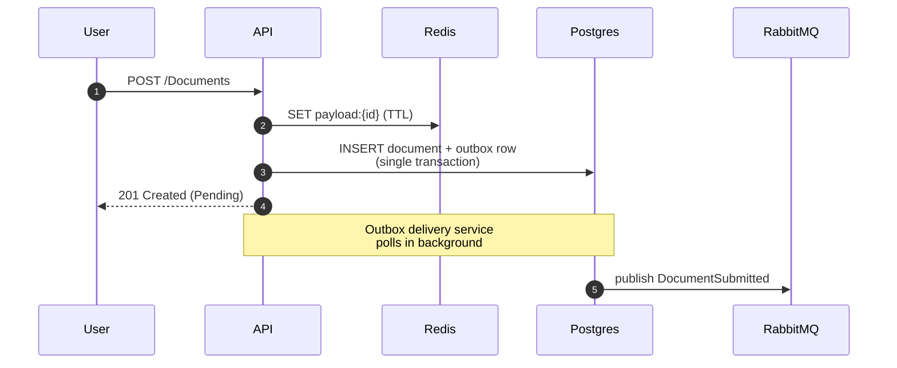
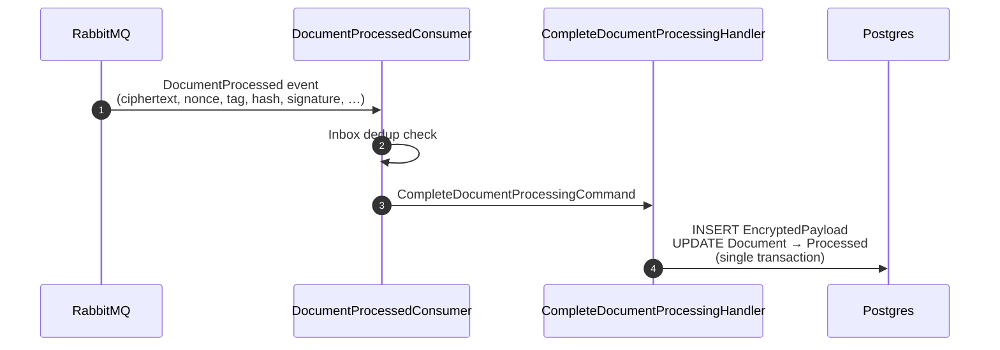

# securedocs-api


SecureDocs is a distributed evidence vault: users submit documents and the system returns a cryptographic proof (hash + Ed25519 signature over the hash and processing timestamp) that anyone holding the public key can verify independently, without trusting the service. The pattern fits use cases like legal document timestamping, regulatory evidence archival, or proof-of-submission systems.

This repository is the API.

---

## Table of contents

- [What this service does](#what-this-service-does)
- [API surface](#api-surface)
- [Tech stack](#tech-stack)
- [Running locally](#running-locally)
- [Configuration](#configuration)
- [Architecture](#architecture)
- [Project structure](#project-structure)
- [Request flows](#request-flows)
- [Design decisions](#design-decisions)
- [Testing](#testing)

---

## What this service does

- Accepts document submissions and persists their metadata.
- Holds the plain payload temporarily so the processing step can pick it up.
- Publishes integration events when a document is submitted, and consumes the reply when processing completes.
- On completion, persists the resulting cryptographic bundle (ciphertext, nonce, tag, hash, signature, algorithm) and transitions the document.
- Exposes endpoints to query the document's state and its integrity proof.

The plain payload never lands on disk in this service.

---

## API surface

| Method | Path | Description |
| --- | --- | --- |
| `POST` | `/Documents` | Submit a document. Returns `201 Created` with `documentId` and `Pending` status. Rate-limited per IP. |
| `GET` | `/Documents/{id}` | Get a document's metadata. `200 OK` or `404 Not Found`. |
| `GET` | `/Documents/{id}/integrity` | Get the integrity proof for a processed document. `200 OK` with `(documentId, hash, signature, algorithm, processedAt)` or `404 Not Found` if not yet processed. |
| `GET` | `/health/live` | Liveness probe. |
| `GET` | `/health/ready` | Readiness probe. Checks Postgres, Redis, RabbitMQ. |

Authentication is out of scope at this phase; all endpoints are open. In production, this service would sit behind an API gateway enforcing JWT-based authentication for external clients (and mTLS for service-to-service traffic), keeping auth concerns out of the service itself.

---

## Tech stack

| Concern | Choice |
| --- | --- |
| Runtime | .NET 8 LTS |
| Web | ASP.NET Core (Controllers) |
| Persistence | EF Core 8 + Npgsql, PostgreSQL 16 |
| Ephemeral payload store | Redis 7 (in-memory only) |
| Broker | RabbitMQ 3.13 |
| Messaging library | MassTransit 8 with `EntityFrameworkOutbox` |
| Mediator | MediatR 12 |
| Validation | FluentValidation 11 |
| Logging | Serilog with correlation IDs |
| Rate limiting | `Microsoft.AspNetCore.RateLimiting` with Redis backing store |
| Health checks | AspNetCore.HealthChecks (Npgsql, Redis, RabbitMq) |
| Unit tests | xUnit, FluentAssertions, NSubstitute |
| Integration tests | xUnit, FluentAssertions, Testcontainers |

---

## Running locally

Requires Docker and the .NET 8 SDK. The EF Core CLI is needed only to manage migrations:

```bash
dotnet tool install --global dotnet-ef --version 8.0.10
```

### 1. Bring up the infrastructure

```bash
docker compose up -d
```

This starts Postgres, Redis, RabbitMQ, and their admin UIs (pgAdmin on `:5050`, RedisInsight on `:5540`, RabbitMQ management on `:15672`).

### 2. Apply database migrations

```bash
dotnet ef database update \
  --project src/SecureDocs.Infrastructure \
  --startup-project src/SecureDocs.API
```

### 3. Run the API

```bash
dotnet run --project src/SecureDocs.API --launch-profile http
```

The API listens on `http://localhost:5245`. Swagger UI is at `/swagger`.

```bash
curl -i -X POST http://localhost:5245/Documents \
  -H "Content-Type: application/json" \
  -H "X-Correlation-Id: my-trace-001" \
  -d '{"payload": "hello"}'
```

---

## Configuration

Defaults live in `appsettings.json`. Every value can be overridden through environment variables using the `__` separator. In production, connection strings must come from environment variables or a secret manager.

| Key | Purpose |
| --- | --- |
| `ConnectionStrings:Postgres` | Postgres connection string |
| `ConnectionStrings:Redis` | Redis connection string |
| `ConnectionStrings:RabbitMq` | RabbitMQ AMQP URI |
| `MassTransit:Outbox:QueryDelaySeconds` | Outbox delivery service poll interval |
| `MassTransit:Outbox:QueryMessageLimit` | Outbox delivery batch size |
| `MassTransit:Retry:IntervalsSeconds` | Consumer retry intervals (seconds) before routing to DLQ |
| `RateLimiting:SubmitDocument:PermitLimit` | Requests allowed per window per IP |
| `RateLimiting:SubmitDocument:WindowSeconds` | Window size for rate limiting |
| `Serilog:MinimumLevel:Default` | Default log level |

---

## Architecture

Four-layer Clean Architecture.



Use cases are dispatched through MediatR. FluentValidation runs as a MediatR pipeline behavior before every handler.

### Aggregates

- **`Document`** — submission metadata and status (`Pending`, `Processed`, `Failed`). Owns its state transitions.
- **`EncryptedPayload`** — the cryptographic outcome for a document. One-to-one with `Document` (unique index on `DocumentId`). Enforces length invariants on hash (32 bytes) and signature (64 bytes).

---

## Project structure

```
src/
├── SecureDocs.Domain/          Aggregates (Document, EncryptedPayload), invariants.
├── SecureDocs.Application/     Commands, queries, validators, integration event
│                               contracts, repository interfaces.
├── SecureDocs.Infrastructure/  EF Core context and configurations, repositories,
│                               Redis payload store, MassTransit setup, consumers,
│                               IIntegrationEventPublisher implementation.
└── SecureDocs.API/             Controllers, exception handlers, correlation-id
                                middleware, DI composition, Program.cs.

tests/
├── SecureDocs.UnitTests/        Handler, validator and domain tests with NSubstitute.
└── SecureDocs.IntegrationTests/ End-to-end tests against real Postgres / Redis /
                                 RabbitMQ spun up by Testcontainers.
```

---

## Request flows

### Submission



`SubmitDocumentHandler` writes the plain payload to Redis under `payload:{documentId}` with a TTL, creates the `Document` aggregate, publishes `DocumentSubmittedIntegrationEvent` through `IIntegrationEventPublisher` (captured by MassTransit's outbox), and commits the unit of work. The aggregate row, the outbox row, and any other tracked changes commit atomically. MassTransit's background delivery service then publishes pending outbox messages to RabbitMQ.

### Processing completion



The inbox (`InboxState` table) guarantees the consumer is idempotent against duplicate broker deliveries. On a failure event, the consumer dispatches `MarkDocumentAsFailedCommand` instead. If the handler throws, MassTransit retries according to the configured policy and routes to the DLQ after exhausting attempts.

### Integrity query

`GET /Documents/{id}/integrity` returns the proof bundle: `documentId`, `hash`, `signature`, `algorithm`, `processedAt`. The ciphertext is intentionally not exposed by this endpoint. Returns `404` if no `EncryptedPayload` exists for that document.

---

## Design decisions

### Cryptographic proof model

The system is positioned as an evidence vault, not as encrypted storage with retrieval. The signature returned by `/integrity` is:

```
signature = Ed25519(hash || processedAt_iso8601)
```

The hash binds the signature to the original document content; concatenating `processedAt` binds it to a point in time. Verification is independent: anyone with the public key can verify the signature without trusting this service. There is intentionally no server-side `/verify` endpoint — it would defeat the chain of trust.

### Transactional outbox via MassTransit

Persisting a document and publishing its event involve two systems (Postgres and RabbitMQ) that cannot share a transaction. `IPublishEndpoint.Publish(...)` does not send to the broker directly — MassTransit's `SaveChanges` interceptor materializes the message into the `OutboxMessage` table inside the same Postgres transaction as the aggregate. A background delivery service polls the outbox using `SELECT … FOR UPDATE SKIP LOCKED` (safe for horizontal scaling) and publishes pending messages. Delivered rows are deleted.

The same setup provides an inbox for consumers (`InboxState` table), giving idempotency against duplicate broker delivery.

### Redis as ephemeral payload store

The plain payload is written to Redis under `payload:{documentId}` with a short TTL, before the Postgres transaction begins. The outbox row carries only the `documentId`; the downstream processor fetches the payload from Redis.

If the Postgres commit fails after the Redis write, the orphan key expires via TTL. If the Redis write fails, the Postgres transaction never starts. The Redis container runs with `--save "" --appendonly no` so the plain payload never touches disk.

### `IIntegrationEventPublisher` abstraction

MassTransit is not referenced from `Application`. Handlers depend on `IIntegrationEventPublisher`, an interface defined in `Application`; the MassTransit implementation lives in `Infrastructure`. This keeps the use cases free of any direct messaging library type and isolates transport changes to a single class.

The implementation also reads the active `X-Correlation-Id` and propagates it as an AMQP header so the id follows the message across services.

### Retry policy and DLQ

Consumers retry on transient failures with intervals configured under `MassTransit:Retry:IntervalsSeconds` (default `[1, 5, 15]`). After the intervals are exhausted, MassTransit publishes the message to a `_error` queue. The DLQ is a regular RabbitMQ queue with no consumer attached, inspectable from the management UI.

### Two-layer validation

`FluentValidation` validates incoming commands at the application boundary (non-empty payload, length within bounds), enforced by a MediatR pipeline behavior. Aggregate invariants (non-empty IDs, hash/signature length, status transitions) are enforced inside the aggregate itself. Input validation can evolve with the public API; invariants belong to the model.

### Idempotent state transitions

`Document.MarkAsProcessed()` and `MarkAsFailed()` are no-ops when the document is already in the target state, and throw when the transition is illegal (`Failed → Processed` and vice versa). This is the line of defense against duplicate broker deliveries that slip past the inbox, and against any future retry mechanism.

### Distributed rate limiting

`POST /Documents` is rate-limited per client IP using `Microsoft.AspNetCore.RateLimiting` with Redis as the backing store (via `RedisRateLimiting.AspNetCore`). Counters are shared across API instances, so the limit is global rather than per-process.

### Structured logging with correlation IDs

Serilog replaces the default logging provider. A `CorrelationIdMiddleware` reads `X-Correlation-Id` from incoming requests (or generates one), pushes it into `LogContext`, echoes it in the response header, and propagates it to the broker as an AMQP header. Every log line during the request is enriched with that property.

`UseSerilogRequestLogging()` emits a single structured log line per HTTP request with method, path, status code, and elapsed time.

### Health checks split into liveness and readiness

- `GET /health/live` — returns `200` if the process is responsive. Used by orchestrators to decide whether to restart the pod.
- `GET /health/ready` — verifies Postgres, Redis, and RabbitMQ reachability. Returns `503` if any dependency is down. Used to decide whether to route traffic to this instance.

### Postgres schema isolation

All application tables, MassTransit's outbox/inbox tables, and the EF Core migrations history live under a dedicated `securedocs` schema. The `public` schema is left untouched.

### Exception handling

Exceptions are mapped to RFC 7807 Problem Details by a chain of `IExceptionHandler` implementations. `ValidationExceptionHandler` produces `400 Bad Request` with field-level errors for FluentValidation failures. `GlobalExceptionHandler` produces `500` with a sanitized message; the full exception is logged but never returned to the client.

### Strongly-typed configuration

Configurable values bind to POCO classes (`MassTransitOptions`, `RedisRateLimiterOptions`, …) and are consumed through `IOptions<T>`. Environment variables can override any value using the `__` separator (`MassTransit__Outbox__QueryDelaySeconds=10`).

---

## Testing

Unit tests cover handlers, validators, and aggregates with NSubstitute fakes. They run in tens of milliseconds and require no infrastructure.

```bash
dotnet test tests/SecureDocs.UnitTests
```

Integration tests boot the full application via `WebApplicationFactory<Program>` against Postgres, Redis, and RabbitMQ containers managed by Testcontainers. Migrations run before the first test. Real HTTP requests go through the in-process pipeline; assertions read directly from Postgres and Redis.

```bash
dotnet test tests/SecureDocs.IntegrationTests
```

Integration tests require Docker.
